# ZestHouse Juice Bar

(Developer: Martyna Nowak)

The ZestHouse Juice Bar website is designed to be accessible and responsive on all devices. It allows easy access to a menu with prices, opening times, gallery, and information about the venue.

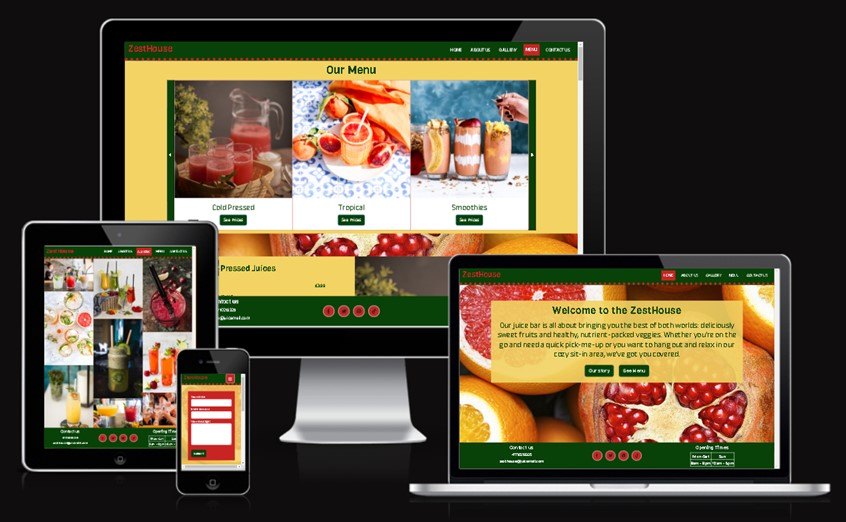

[Live webpage](https://mmnowak.github.io/zesthouse/)

---

## Table of Content

1. [Project Goals](#project-goals)
2. [User Experience](#user-experience)
    1. [User Requirements and Expectations](#user-requirements-and-expectations)
    2. [User Stories](#user-stories)
3. [Design](#design)
    1. [Colour scheme](#colour-scheme)
    2. [Typography](#typography)
    3. [Imagery](#imagery)
    4. [Wireframes](#wireframes)
4. [Features](#features)
5. [Technologies Used](#technologies-used)
    1. [Languages](#languages)
    2. [Frameworks and Tools](#frameworks-and-tools)
6. [Testing](#testing)
    1. [HTML Validation](#html-validation)
    2. [CSS Validation](#css-validation)
    3. [Accessibility](#accessibility-testing)
    4. [Performance](#performance)
    5. [Device testing](#performance-tests-on-various-devices)
    6. [Browser compatibility](#browser-compatibility)
    7. [Testing user stories](#testing-user-stories)
7. [Credits](#credits)
    1. [Media](#media)
    2. [Code used](#code-used)
    3. [Content](#content)
8. [Bugs](#bugs)
9. [Deployment](#deployment)
11. [Acknowledgements](#acknowledgements)

## Project Goals
1. A website that can be navigated easily and intuitively.
2. Easy access to the drink and food menu and prices.
3. A visual representation of the products.
4. Clearly presented information about the venue and avaliable facilities.
5. Easy access for the user to contact the venue with questions and feedback.
6. A clean design that catches the eye and represents the general 'vibe' of the venue.
7. A website that looks good and responds correctly on all device sizes.
8. A website that is accessible to all users.

## User Experience

### User Requirements and Expectations
1. Links and buttons that work as expected.
2. A simple and intuitive navigation system.
3. Information presented in clear and concise manner.
4. Visually appealing design.
5. Easy way to submit questions and feedback.
6. Accessibility.

### User Stories

#### First-time Visitor
1.	As a first-time user, I want to know what products the ZestHouse is selling.
2.	As a first-time user, I want to know the prices.
3.	As a first-time user, I want to know the location.
4.	As a first-time user, I want to know opening times.
5.	As a first-time user, I want to know facilities available.
6.	As a first-time user, I want to easy contact the venue with any questions I might have.
7.	As a first-time user, I want to know more about the venue and its history.

#### Returning Visitor
8.	As a returning user, I want to be able to send my feedback easily.
9.	As a returning user, I want to find the ZestHouse on social media.
10.	As a returning user, I want to see photos from past events held at the venue that I attended.

#### Site Owner
11.	As the site owner, I want the users to be able to view the site on a range of device sizes.
12.	As the site owner, I want to make it easy for potential customers to see facilities and features available.
13.	As the site owner, I want to allow customers to contact the ZestHouse with their questions or feedback.
14.	As the site owner, I want the users to easily find our menu and prices.
15.	As the site owner, I want the users to be directed back to the homepage should they come across a 404 error.
16.	As the site owner, I want the users to feel their questions and feedback are most welcome.
17.	As the site owner, I want the customers to easily find directions to the venue.
18. As the site owner, I want the users to be able to navigate the website easily.

## Design

### Colour Scheme
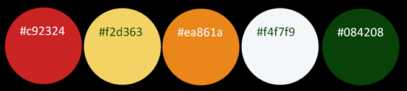

Two of the colours (#c92324 and #ea861a) used were chosen using a color picker from the background image(see the Imagery section below). Then a [colour palette generator](http://colormind.io/bootstrap/) was used to choose complimentary colours (#084208 and #f4f7f9). [The contrast checker](https://webaim.org/resources/contrastchecker/) showed that the contrast between the navbar background and text is good (ratio 10.88:1). However, the contrast ratio was too low for the colors used for the main paragraphs (#ea861a for the background and #084208 for the text). Thus, to improve accessibility, a lighter color (#f2d363) was choosen for the background, bringing the contrast ratio score to 7.96:1.

### Typography

The fonts used for the website are imported from [Google Fonts](https://fonts.google.com/).
The font chosen for the logo as well as all the headings is Viga. It is described as having a good performance on the screen as well as a great personality.

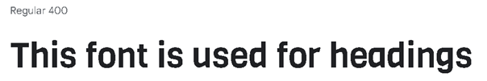

A [font pairing website](http://www.ourownthing.co.uk/fontpairing/) was then used to pick Anek Bangla, the font used for all the other text, such as paragraphs and buttons.

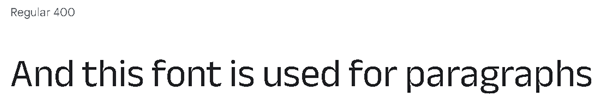

### Imagery

The image main image, used for the background, was chosen due to its vibrant colours and the fruit looking like its bursting with flavour and vitamins. It is supposed to be associated with concepts such as freshness, nutrition, health and wellness. 

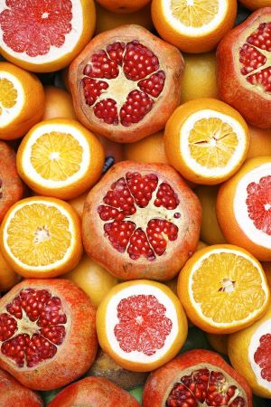

### Wireframes

Wireframes were created for mobile and desktop using Balsamiq software.

Index Page

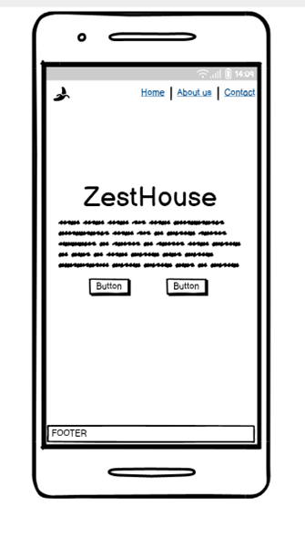
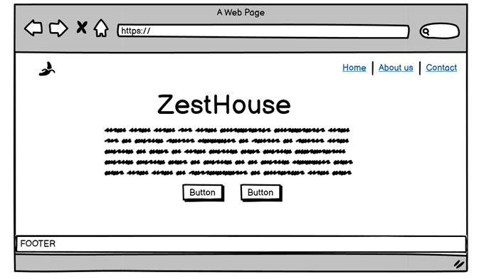

About Us Page

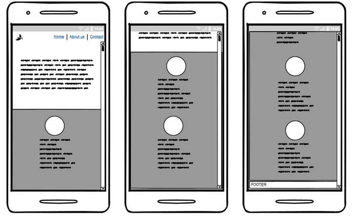
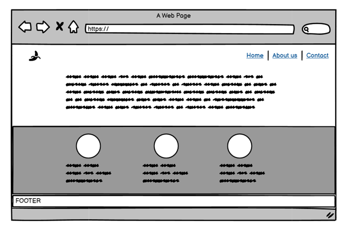

Gallery Page

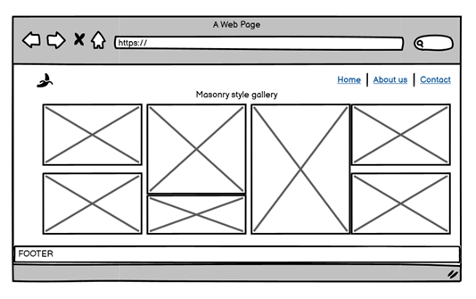
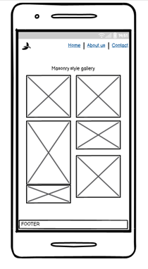

Menu Page

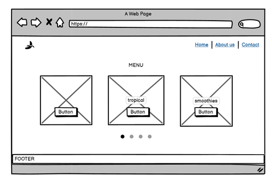
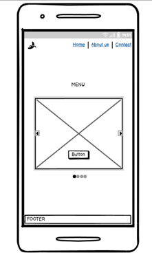

Contact Us Page

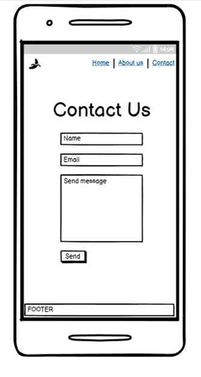
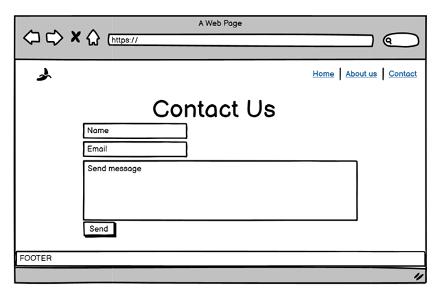

## Features

### Logo and Navigation bar
* Featured on all pages, the navigation bar is fully responsive and changes to a burger toggler menu on smaller screens.
* The left of the navigation bar features a logo, which when clicked on leads to the index page. The right side contains links to the Home Page, About Us Page, Gallery, Menu Page and Contact Us Page.
* The link to the page the user is currently on is indicated by a different colour background.
* User stories covered: 11, 18.

### Footer
* Featured on all pages.
* Contains three sections: contact details, social media links and opening times.
* Social media links are represented by easily identified icons.
* User stories covered: 4, 6, 9.

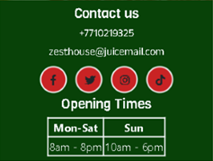

### Index Page
* Features a short text introducing the venue.
* Includes two call-to-action buttons, leading to the Menu page and About Us Page.
*  User stories covered: 11, 18
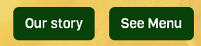

### About Us Page
* Includes a paragraph introducing the owners and the idea behind the business.
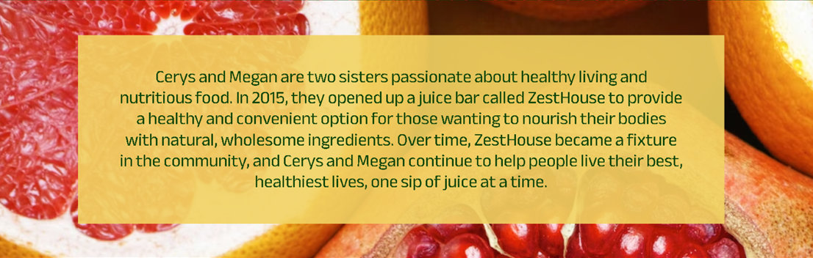
* Features description of facilities avaliable, accompanied by relevant pictures.

* Includes the venue location on an embeded Google Map.
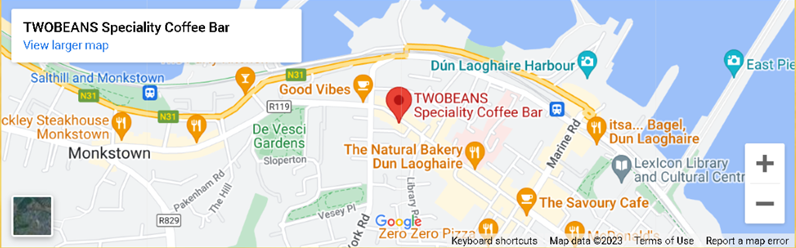
* User stories covered: 3, 5, 7, 12.

### Gallery Page
* A masonry style picture gallery. Arranged in three columns on large- and medium-sized devices, and a single column on small screens.
* User stories covered: 10, 11.

### Menu Page
* The menu overview takes form of a carousel containing cards, each card representing a menu section with a corresponding title and image. It shows three cards per slide on medium and large devices and one card per slide on small devices. It contains nine sections (Cold pressed juices, tropical juices, smoothies, smoothie bowls, juice shots, slushies, hot drinks, alcoholic drinks and snacks). 
* Allows the user to navigate via back and forward arrows, located at the top on small screens and at the sides on medium and large screens.

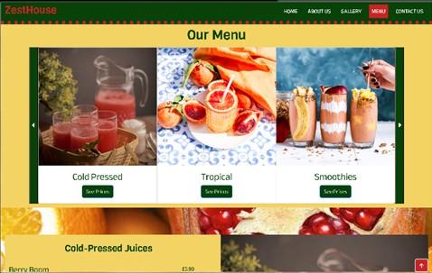

* Clicking the 'see prices' button for each card leads to a price menu. This allows the user to quickly locate prices of items they are interested in.
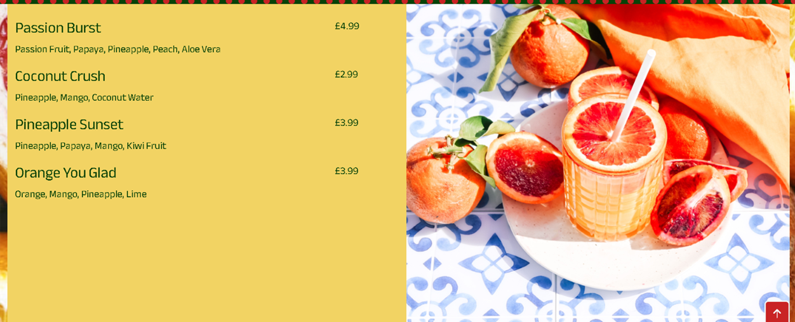
* A back-to-top button in the bottom right corner of the price menus leads back to the carousel with menu sections. It allows the user to navigate the menu easier and quicker. The back-to-top option is represented by a commonly identified icon.

* User stories covered: 1, 2, 11, 14, 18.

### Contact Us Page
* Features a contact form which allows the user to easily contact the venue with any questions or feedback.
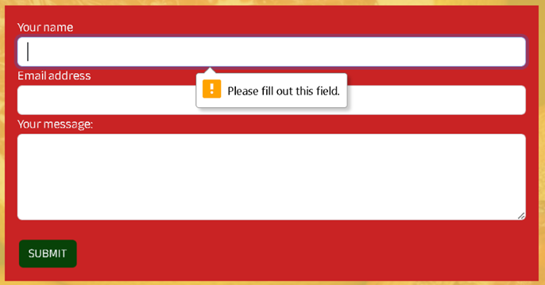 
* Contains contact details such as an address, a phone number and an email address.

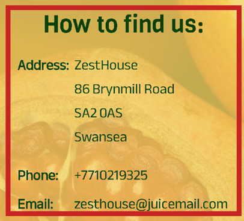

* User stories covered: 3, 6, 8, 13.

### Thank You Page
* A message thanks the user for submitting the contact form.
* Has a 'go back' button leading back to the contact.html page.
* User stories covered: 16.

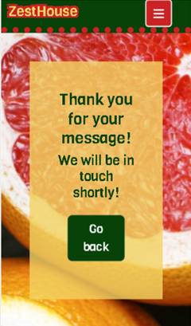

### 404
* Custom error page which contains a button leading back to the index page.
* User stories covered: 15, 18.

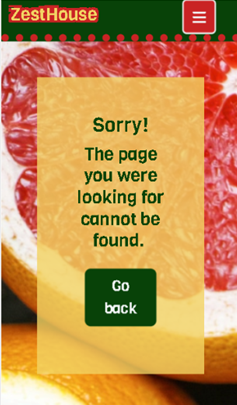

### Accessibility
The following steps were taken to ensure the website is accessible:
* A contrast checker tool was used when deciding on the colour palette to ensure a sufficient colour contrast throughout the page.
* Aria-labels were added to the icons to enable screen readers to understand them.
* Aria-current was used to indicate the current page for screen readers.
* All images are attributed with alternative descriptions.
* Sans serif fonts were chosen to ensure the website is dyslexia-friendly.
* Semantic HTML was used.

## Technologies Used

### Languages

* [HTML](https://en.wikipedia.org/wiki/HTML)
* [CSS](https://en.wikipedia.org/wiki/CSS)

### Frameworks and Tools

* [Bootstrap](https://getbootstrap.com/)
* [Balsamiq](https://balsamiq.com/wireframes/)
* [GitHub](https://github.com/)
* [GitPod](https://www.gitpod.io/)
* [Google Fonts](https://fonts.google.com/)
* [Colormind.io](http://colormind.io/)
* [Webaim.org Contrast Checker](https://webaim.org/)
* [Hover.css by Ian Lunn](https://ianlunn.github.io/Hover/)
* [FontAwesome](https://fontawesome.com/)

## Testing

### HTML Validation
The W3C Markup Validation Service was used to validate the HTML of the website. No errors were found.

See scores:

[Index.html](https://validator.w3.org/nu/?doc=https%3A%2F%2F8000-mmnowak-milestoneprojec-kvzu7gsosff.ws-eu97.gitpod.io%2Findex.html)

[About.html](https://validator.w3.org/nu/?doc=https%3A%2F%2F8000-mmnowak-milestoneprojec-kvzu7gsosff.ws-eu97.gitpod.io%2Fabout.html)

[Gallery.html](https://validator.w3.org/nu/?doc=https%3A%2F%2F8000-mmnowak-milestoneprojec-kvzu7gsosff.ws-eu97.gitpod.io%2Fgallery.html)

[Menu.html](https://validator.w3.org/nu/?doc=https%3A%2F%2F8000-mmnowak-milestoneprojec-kvzu7gsosff.ws-eu97.gitpod.io%2Fmenu.html)

[Contact.html](https://validator.w3.org/nu/?doc=https%3A%2F%2F8000-mmnowak-milestoneprojec-kvzu7gsosff.ws-eu97.gitpod.io%2Fcontact.html)

### CSS Validation
The W3C Jigsaw CSS Validation Service was used to validate the css file for the website. No errors were found.
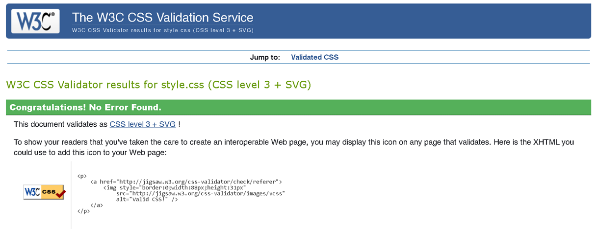

### Accessibility Testing
The WAVE web accessibility evaluation tool by WebAIM was used to ensure the website is fully accessible.

See scores:

[Index.html](https://wave.webaim.org/report#/https://8000-mmnowak-milestoneprojec-kvzu7gsosff.ws-eu97.gitpod.io/)

[About.html](https://wave.webaim.org/report#/https://8000-mmnowak-milestoneprojec-kvzu7gsosff.ws-eu97.gitpod.io/about.html)

[Gallery.html](https://wave.webaim.org/report#/https://8000-mmnowak-milestoneprojec-kvzu7gsosff.ws-eu97.gitpod.io/gallery.html)

[Menu.html](https://wave.webaim.org/report#/https://8000-mmnowak-milestoneprojec-kvzu7gsosff.ws-eu97.gitpod.io/menu.html)

[Contact.html](https://wave.webaim.org/report#/https://8000-mmnowak-milestoneprojec-kvzu7gsosff.ws-eu97.gitpod.io/contact.html)

### Performance tests on various devices

The website was used on following devices:
* Thinkpad Yoga 460
* Xiaomi 11 Lite

As well as on all avaliable device options when using Google Chrome Developer tools.

### Browser compatibility

The website was tested on following browsers:

* Google Chrome
* Opera
* Microsoft Edge

### Testing user stories

#### First-time User Goals

1. As a first-time user, I want to know what products the ZestHouse is selling.

| **Feature** | **Action** | **Expected Result** | **Actual Result** |
|:-----------:|:----------:|:-------------------:|:-----------------:|
| Menu | Navigate to the menu page | See the product list | Works as expected |
| Button | Click on the 'See Menu' button on the menu page | Go to the menu | Works as expected |

2. As a first-time user, I want to know the prices.

| **Feature** | **Action** | **Expected Result** | **Actual Result** |
|:-----------:|:----------:|:-------------------:|:-----------------:|
| Menu | Navigate to the menu page | See the prices | Works as expected |
| Button | Click on the 'See Menu' button on the menu page | Go to the menu | Works as expected |

3.	As a first-time user, I want to know the location.

| **Feature** | **Action** | **Expected Result** | **Actual Result** |
|:-----------:|:----------:|:-------------------:|:-----------------:|
| About Us | Navigate to the about us page and scroll down | Locate the map | Works as expected |
| Contact Us | Navigate to the contact us page | Find the address | Works as expected |

4.	As a first-time user, I want to know opening times.

| **Feature** | **Action** | **Expected Result** | **Actual Result** |
|:-----------:|:----------:|:-------------------:|:-----------------:|
| Footer | Locate the footer | See the opening times | Works as expected |

5.	As a first-time user, I want to know facilities available.

| **Feature** | **Action** | **Expected Result** | **Actual Result** |
|:-----------:|:----------:|:-------------------:|:-----------------:|
| About us | Navigate to the About us page | Scroll down to the facilities section | Works as expected |

6.	As a first-time user, I want to easy contact the venue with any questions I might have.

| **Feature** | **Action** | **Expected Result** | **Actual Result** |
|:-----------:|:----------:|:-------------------:|:-----------------:|
| Contact us | Navigate to the Contact us page | Use the form to submit a message | Works as expected |
| Contact us | Navigate to the Contact us page | Click on the email address to send email | Works as expected |
| Contact us | Navigate to the Contact us page | Click on the phone number to call | Works as expected |
| Footer | Locate the footer | Click on the email address to send email | Works as expected |
| Footer | Locate the footer | Click on the phone number to call | Works as expected |

7.	As a first-time user, I want to know more about the venue and its history.

| **Feature** | **Action** | **Expected Result** | **Actual Result** |
|:-----------:|:----------:|:-------------------:|:-----------------:|
| Button | Click on the 'Our Story' button on the menu page | Go to the About us page | Works as expected |
| Index Page | Open the index page | Find the summary paragraph | Works as expected |
| About us | Navigate to the About us page | Locate the Our Story section | Works as expected |

#### Returning User 

8.	As a returning user, I want to be able to send my feedback easily.

| **Feature** | **Action** | **Expected Result** | **Actual Result** |
|:-----------:|:----------:|:-------------------:|:-----------------:|
| Contact us | Navigate to the Contact us page | Use the form to submit a message | Works as expected |
| Contact us | Navigate to the Contact us page | Click on the email address to send email | Works as expected |
| Footer | Locate the footer | Click on the email address to send email | Works as expected |

9.	As a returning user, I want to find the venue on social media.

| **Feature** | **Action** | **Expected Result** | **Actual Result** |
|:-----------:|:----------:|:-------------------:|:-----------------:|
| Footer | Locate the footer | Click on the social media icons | Works as expected |

10.	As a returning user, I want to see photos from past events held at the venue that I attended.

| **Feature** | **Action** | **Expected Result** | **Actual Result** |
|:-----------:|:----------:|:-------------------:|:-----------------:|
| Gallery | Navigate to the gallery page | View gallery images | Works as expected |

#### Site owner goals

11.	As the site owner, I want the users to be able to view the site on a range of device sizes.

| **Feature** | **Action** | **Expected Result** | **Actual Result** |
|:-----------:|:----------:|:-------------------:|:-----------------:|
| Navigation bar | Open any link | Go to desired page and view on device | Works as expected |

12.	As the site owner, I want to make it easy for potential customers to see facilities and features available.

| **Feature** | **Action** | **Expected Result** | **Actual Result** |
|:-----------:|:----------:|:-------------------:|:-----------------:|
| About us | Navigate to the About us page | Scroll down to the facilities section | Works as expected |

13.	As the site owner, I want to allow customers to contact the ZestHouse with their questions or feedback.

| **Feature** | **Action** | **Expected Result** | **Actual Result** |
|:-----------:|:----------:|:-------------------:|:-----------------:|
| Contact us | Navigate to the Contact us page | Use the form to submit a message | Works as expected |
| Contact us | Navigate to the Contact us page | Click on the email address to send email | Works as expected |
| Contact us | Navigate to the Contact us page | Click on the phone number to call | Works as expected |
| Footer | Locate the footer | Click on the email address to send email | Works as expected |
| Footer | Locate the footer | Click on the phone number to call | Works as expected |

14.	As the site owner, I want the users to easily find our menu and prices.

| **Feature** | **Action** | **Expected Result** | **Actual Result** |
|:-----------:|:----------:|:-------------------:|:-----------------:|
| Menu | Navigate to the menu page | See the product list | Works as expected |
| Menu | Navigate to the menu page | See the prices | Works as expected |
| Button | Click on the 'See Menu' button on the menu page | Go to the menu | Works as expected |

15.	As the site owner, I want the users to be directed back to the homepage should they come across a 404 error.

| **Feature** | **Action** | **Expected Result** | **Actual Result** |
|:-----------:|:----------:|:-------------------:|:-----------------:|
| Go back button | Click on the 'go back' button on the 404 error page | Find the homepage | Works as expected |
| Logo | Click on the logo to navigate back to the index page | Find the homepage | Works as expected |
| Logo | Click on the logo to navigate back to the index page | Find the homepage | Works as expected |
| Navigation bar | Click any link to navigate back to desired page | Find desired page | Works as expected |

16.	As the site owner, I want the users to feel their questions and feedback are most welcome.

| **Feature** | **Action** | **Expected Result** | **Actual Result** |
|:-----------:|:----------:|:-------------------:|:-----------------:|
| Thank you page | Submit a message using the form | See the 'thank you' message | Works as expected |

17.	As the site owner, I want the customers to easily find directions to the venue.

| **Feature** | **Action** | **Expected Result** | **Actual Result** |
|:-----------:|:----------:|:-------------------:|:-----------------:|
| About Us | Navigate to the about us page and scroll down | Locate the map | Works as expected |
| Contact Us | Navigate to the contact us page | Find the address | Works as expected |

18. As the site owner, I want the users to be able to navigate the website easily.

| **Feature** | **Action** | **Expected Result** | **Actual Result** |
|:-----------:|:----------:|:-------------------:|:-----------------:|
| Navigation bar | Click any link to go to desired page | Find desired page | Works as expected |
| Call to action buttons | Click on the buttons to go to a relevant page or section | Find the relevant page or section | Works as expected |
| Back-to-top button on the menu page| Click on the button to go back to the menu overview | Scroll up | Works as expected |

## Credits

### Media

The main image, used for the background, is by [Engin Akyurt on Unsplash](https://unsplash.com/photos/drzu0uPgmoU)

#### About Us Page
[Photo by Alexas Fotos on Pexels](https://www.pexels.com/photo/close-up-photo-of-stacked-tissue-rolls-10760874/)

[Photo by OVAN on Pexels](https://www.pexels.com/photo/person-sitting-facing-laptop-computer-with-sketch-pad-57690/)

[Photo by Ivan Samkov on Pexels](https://www.pexels.com/photo/people-celebrating-a-little-girl-s-birthday-7922014/)

#### Menu Page
[Photo by Pranjall Kumar on Pexels](https://www.pexels.com/photo/red-juice-in-glasses-8600079/)

[Photo by Studio Naae on Pexels](https://www.pexels.com/photo/close-up-shot-of-a-glass-of-fruit-juice-13546345/)

[Photo by Brenda Godinez on Unsplash](https://unsplash.com/s/photos/smoothie?utm_source=unsplash&utm_medium=referral&utm_content=creditCopyText)

[Photo by Vicky Ng on Unsplash](https://unsplash.com/s/photos/smoothie-bowl?utm_source=unsplash&utm_medium=referral&utm_content=creditCopyText)

[Photo by Toa Heftiba on Unsplash](https://unsplash.com/s/photos/juice-shots?utm_source=unsplash&utm_medium=referral&utm_content=creditCopyText)

[Photo by Mwabonje on Pexels](https://www.pexels.com/photo/close-up-photo-of-latte-art-1714950/)

[Photo by The Castlebar on Pexels](https://www.pexels.com/photo/close-up-shot-of-glasses-of-cocktails-9201052/)

[Photo by Roberto Shumski on Pexels](https://www.pexels.com/photo/snack-foods-on-round-wooden-tray-9134584/)

[Photo by Melissa Walker Horn on Unsplash](https://unsplash.com/photos/ptvKywiTghw?utm_source=unsplash&utm_medium=referral&utm_content=creditCopyText)

#### Gallery Page
[Photo by Brooke Lark on Unsplash](https://unsplash.com/photos/t7wg7BJU2-s)

[Photo by Farhad Ibrahimzade on Unsplash](https://unsplash.com/photos/CiDpRQ9oPso)

[Photo by Whitney Wright on Unsplash](https://unsplash.com/photos/TgQkxQc-t_U)

[Photo by Louis Hansel on Unsplash](https://unsplash.com/photos/BT2hIfR5oj8)

[Photo by Marc Babin on Unsplash](https://unsplash.com/photos/22fsBrruHPQ)

[Photo by Louis Hansel on Unsplash](https://unsplash.com/photos/S3E8Y_SRPUw)

[Photo by Louis Hansel on Unsplash](https://unsplash.com/photos/H7Lti8qa0dE?utm_source=unsplash&utm_medium=referral&utm_content=creditShareLink)

[Photo by Louis Hansel on Unsplash](https://unsplash.com/photos/byzvm4J8Ljw)

[Photo by Helena Yankovska on Unsplash](https://unsplash.com/photos/7EbGkOm8pWM)

### Code Used
* The HTML for the [navigation bar](https://getbootstrap.com/docs/5.3/components/navbar/) was taken from Bootstrap v5.3 documentation snippets.
* The carousel containing cards used on the menu.html page was inspired by a tutorial by [Coding Yaar](https://codingyaar.com/bootstrap-4-carousel-multiple-items-responsive/)
* The HTML for the [two carousels](https://getbootstrap.com/docs/5.3/components/carousel/) on the menu.html page, as well as the [cards](https://getbootstrap.com/docs/5.3/components/card/) used within these carousels, was taken from Bootstrap v5.3 documentation snippets.

### Content

Content for the website was written by Martyna Nowak.

## Bugs

### Solved bugs
* #### Footer
On the pages containing smaller amount of content, such as index.html and contact.html, footer was positioned halfway up the page instead of at the bottom. I tried various solutions, such as adding a sticky-bottom class or position: absolute or setting bottom margin to 0; none of them worked appropriately. While position: fixed achieved the goal of keeping the footer at the bottom on all the pages, it caused the footer to obscure content on some pages. I created id 'ftr' to apply position:fixed property only to pages with small amount of content. However, some elements were still obscured while viewing the page on mobile. My final solution was to use media query and apply position:fixed to id 'ftr' only for medium- and large-sized devices. According to manual testing carried on using Google Developer Tools, the solution worked and the footer remains at the bottom of all the pages on all devices without obscuring any content.
* #### Horizontal Overflow
A horizontal scrollbar kept appearing while viewing the website on mobile. As reccomended to me on slack, I used Unicorn Revealer Chrome Extension to try and find out which element causes the overflowing, but to no avail. Finally, I followed an instruction from https://www.smashingmagazine.com/ and added a JavaScript snippet to the browser console. This showed that the culprit was 'row' element within the footer. The overflow was fixed by adding 'm-0' class to the element.

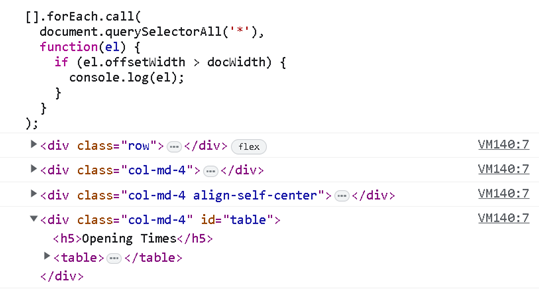

## Deployment

Include instructions here on how to deploy your project. For your first project you will most likely be using GitHub Pages.

### Local Development

The local development section gives instructions on how someone else could make a copy of your project to play with on their local machine. This section will get more complex in the later projects, and can be a great reference to yourself if you forget how to do this.

#### How to Fork

Place instructions on how to fork your project here.

#### How to Clone

Place instructions on how to clone your project here.
  
##  Acknowledgments

If someone helped you out during your project, you can acknowledge them here! For example someone may have taken the time to help you on slack with a problem. Pop a little thank you here with a note of what they helped you with (I like to try and link back to their GitHub or Linked In account too). This is also a great place to thank your mentor and tutor support if you used them.

